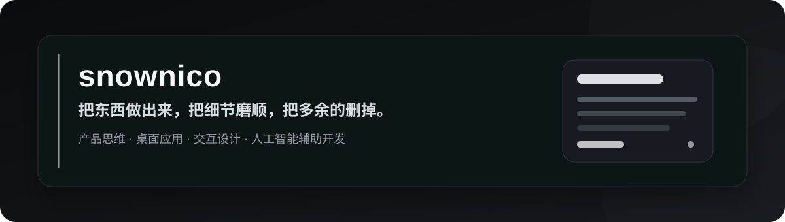
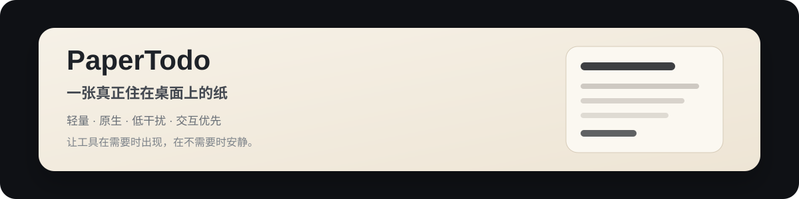

  
    
  <h1>snownico</h1>
  <h3>做真正能用的东西，也愿意把细节磨到顺手为止。</h3>
  
产品思维 · 桌面应用 · 交互设计 · 人工智能辅助开发

   

---

## 关于我

我更习惯从“这个东西实际用起来顺不顺”出发，而不是先堆功能。

喜欢把想法快速做成能跑的版本，再一点点删掉多余的层级、交互和视觉负担。  
比起“看起来很强”，我更在意软件是不是**真的轻、真的快、真的好用**。

目前主要在做：

- Windows 桌面应用与原生交互
- 人工智能辅助开发与产品原型
- 微信小程序与轻量工具
- 人工智能视频与内容生产
- 日语相关内容与跨语言工作

---

## 现在最主要的项目

**PaperTodo** 是我目前投入最多精力的项目。

它不是“再做一个待办软件”，而是希望让桌面上真正存在几张安静、轻量、随手就能用的纸。

我比较在意这些东西：

- 纸片优先，而不是管理后台优先
- 交互优先，而不是功能堆叠优先
- 原生实现，而不是为了省事套一层网页
- 该出现时出现，不需要时尽量安静
- 多屏、高刷、缩放、拖拽这些细节也值得认真打磨

  <a href="https://github.com/snownico0722/PaperTodo">查看项目</a>
  ·
  <a href="https://snownico0722.github.io/PaperTodo/">项目网站</a>
  ·
  <a href="https://github.com/snownico0722/PaperTodo/releases/latest">下载最新版本</a>

---

## 我偏好的做事方式

<table>
<tr>
<td width="50%" valign="top">

<h3>先做出来</h3>

想法不落地就只是想法。

我喜欢先让东西真正跑起来，再判断它值不值得继续做。

</td>
<td width="50%" valign="top">

<h3>再把多余的删掉</h3>

功能不是越多越好。

每一层交互、每一个按钮、每一个弹窗，都应该证明自己有存在的必要。

</td>
</tr>

<tr>
<td width="50%" valign="top">

<h3>交互比参数更诚实</h3>

用户不会先看架构图。

响应速度、拖拽手感、动画节奏、操作路径，这些才是最先被感受到的东西。

</td>
<td width="50%" valign="top">

<h3>人工智能是工具，不是招牌</h3>

我会大量使用人工智能提高开发和探索效率。

但最终留下来的，应该是产品本身，而不是“用了人工智能”这件事。

</td>
</tr>
</table>

---

## 常用方向

  
<code>C#</code>　<code>WPF</code>　<code>.NET</code>　<code>JavaScript</code>　<code>Windows</code>

  
<code>微信小程序</code>　<code>云开发</code>　<code>人工智能辅助开发</code>　<code>产品设计</code>　<code>交互设计</code>

---

## 另外一些关键词

  
<strong>原生</strong>　·　<strong>轻量</strong>　·　<strong>低干扰</strong>　·　<strong>高响应</strong>　·　<strong>少管理</strong>

  
<strong>多屏</strong>　·　<strong>高刷</strong>　·　<strong>桌面常驻</strong>　·　<strong>工具感</strong>　·　<strong>长期打磨</strong>

---

  <h3>不增加没有必要的交互层级。</h3>
  <h3>不制造没有必要的视觉焦点。</h3>
   
  <strong>把东西做出来，把细节磨顺，把多余的删掉。</strong>

