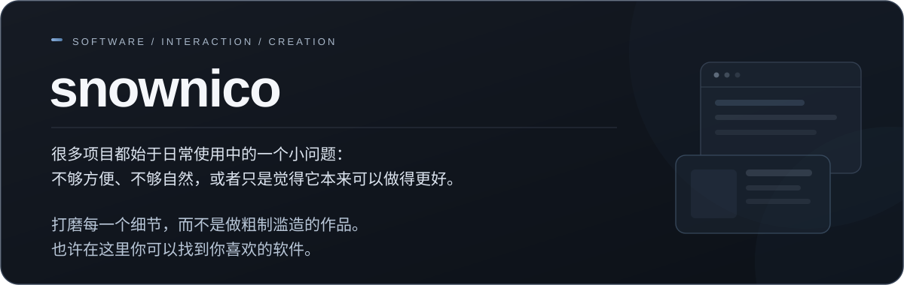

  

## 精选作品

<table>
  <tr>
    <td width="50%" valign="top">
      <h3><a href="https://github.com/snownico0722/PaperTodo"> PaperTodo ↗</a></h3>
      
让便签与待办自然地留在桌面上。支持 Markdown、边缘胶囊与多显示器交互。

    </td>
    <td width="50%" valign="top">
      <h3><a href="https://github.com/snownico0722/index-main"> 个人导航 · index-main ↗</a></h3>
      
完全本地的浏览器起始页。整理常用站点，自由切换搜索引擎与外观主题。

    </td>
  </tr>
  <tr>
    <td width="50%" valign="top">
      <h3><a href="https://github.com/snownico0722/NeatWin"> NeatWin ↗</a></h3>
      
从窗口之间的任务关系出发，让桌面排布更符合实际使用习惯。

    </td>
    <td width="50%" valign="top">
      <h3><a href="https://github.com/snownico0722/PopTab"> PopTab ↗</a></h3>
      
把已有浏览器标签页变成无工具栏的独立窗口，保留原有页面状态。

    </td>
  </tr>
</table>

## 更多项目

<table>
  <tr>
    <td width="50%" valign="top">
      <h3>桌面与系统</h3>
      
<strong><a href="https://github.com/snownico0722/apkshellext">apkshellext ↗</a></strong> 在资源管理器中查看应用安装包的图标、信息和右键操作。

      
<strong><a href="https://github.com/snownico0722/ScreenToGif-240hz">ScreenToGif-240hz ↗</a></strong> 为 ScreenToGif 扩展高刷新率录制能力。

      
<strong><a href="https://github.com/snownico0722/NoFocusLoss">NoFocusLoss ↗</a></strong> 减少部分游戏切换到后台后自动暂停的问题。

      
<strong><a href="https://github.com/snownico0722/wpf-notifyicon">wpf-notifyicon ↗</a></strong> 改进 WPF 托盘菜单的位置、焦点与弹出行为。

      
<strong><a href="https://github.com/snownico0722/AutoHotkeyCN">AutoHotkeyCN ↗</a></strong> AutoHotkey v2 的简体中文版本整合。

      
<strong><a href="https://github.com/snownico0722/AutoHotkeyUX">AutoHotkeyUX ↗</a></strong> AutoHotkey 安装与管理界面的简体中文本地化。

      
<strong><a href="https://github.com/snownico0722/Ahk2Exe">Ahk2Exe ↗</a></strong> AutoHotkey 脚本编译器的简体中文本地化。

    </td>
    <td width="50%" valign="top">
      <h3>浏览器与网页</h3>
      
<strong><a href="https://github.com/snownico0722/Bookmarks-to-html">Bookmarks-to-html ↗</a></strong> 把浏览器收藏夹整理成可离线打开的导航页。

      
<strong><a href="https://github.com/snownico0722/bookmark-bar-default-resetter">bookmark-bar-default-resetter ↗</a></strong> 让 Chrome 新书签默认保存到书签栏。

      
<strong><a href="https://github.com/snownico0722/Project-null">Project-null ↗</a></strong> Linux DO 页面的身份替换与内容简化脚本。

      
<strong><a href="https://github.com/snownico0722/gptopt">gptopt ↗</a></strong> 改善 ChatGPT 手机横屏远程操作时的页面体验。

      
<strong><a href="https://github.com/snownico0722/prompt-manager">prompt-manager ↗</a></strong> 无需账号的本地提示词管理网站。

      
<strong><a href="https://github.com/snownico0722/promptmanager">promptmanager ↗</a></strong> 跨网站使用的提示词管理扩展，支持工作区与本地存储。

      
<strong><a href="https://github.com/snownico0722/snownico0722.github.io">snownico0722.github.io ↗</a></strong> 个人静态展示站点的前端源码。

    </td>
  </tr>
  <tr>
    <td width="50%" valign="top">
      <h3>移动与日常</h3>
      
<strong><a href="https://github.com/snownico0722/BeadMaster">BeadMaster ↗</a></strong> 手机端拼豆图纸校准、逐格标记与色彩统计。

      
<strong><a href="https://github.com/snownico0722/Hail_lock">Hail_lock ↗</a></strong> 通过冻结和暂停 Android 应用辅助防沉迷。

    </td>
    <td width="50%" valign="top">
      <h3>工具与实验</h3>
      
<strong><a href="https://github.com/snownico0722/hookweb">hookweb ↗</a></strong> Android WebView 内核扫描与 LSPosed 相关实验。

      
<strong><a href="https://github.com/snownico0722/daily-software-kit">daily-software-kit ↗</a></strong> 日常软件配置、代理分流规则和实用脚本整理。

      
<strong><a href="https://github.com/snownico0722/mpv-vs">mpv-vs ↗</a></strong> 供 mpv 使用的 VapourSynth 脚本与资料。

    </td>
  </tr>
</table>
